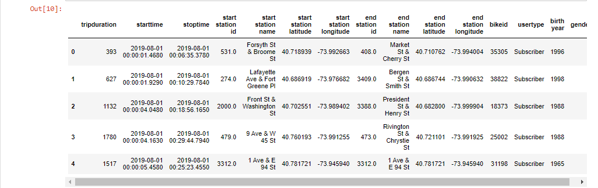
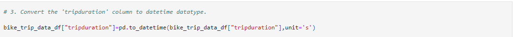
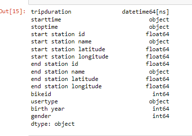

# BikeSharing_Tableau

## Overview & Purpose

The purpose of this analysis is to create visualizations on Tableau using worksheets, dashboards and stories with Citibike bike-sharing data in New York City to convince investors that a similar bike-sharing service in Des Moines can be a viable business opportunity.

## Tools Used
- Tableau Public
- Python (Pandas)
- Data Source - [Citi Bike](https://ride.citibikenyc.com/system-data)( 201908-citibike-tripdata.csv.zip)

## Results

#### Python

The original Citi Bike data includes a "tripduration" column with datatype int64. Before analyzing the data on Tableau, a DataFrame was created using the Pandas library on Python and the datatype of the "tripduration" column was changed from int64 to datetime format.

First, the file was opened as a DataFrame using Pandas

Then, date time column was converted from int64 to datetime

Then Tableau Public has been used to analyze the data and create powerful visualizations.

