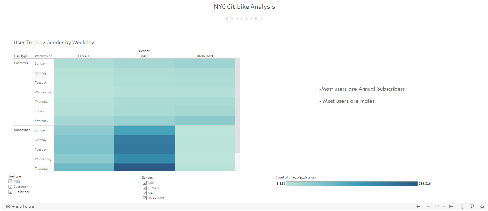

# BikeSharing_Tableau

## Overview & Purpose

The purpose of this analysis is to create visualizations on Tableau using worksheets, dashboards and stories with Citibike bike-sharing data ((August,2019) in New York City to convince investors that a similar bike-sharing service in Des Moines can be a viable business opportunity. Please view the Tableau Story [here](https://public.tableau.com/app/profile/sukanya.ghosh3003/viz/Module_Challenge_16534889152630/NYCCitibikeStory?publish=yes).

## Tools Used
- Tableau Public
- Python (Pandas)
- Data Source - [Citi Bike](https://ride.citibikenyc.com/system-data)( 201908-citibike-tripdata.csv.zip)

## Results

#### Python

The original Citi Bike data includes a "tripduration" column with datatype int64. Before analyzing the data on Tableau, a DataFrame was created using the Pandas library on Python and the datatype of the "tripduration" column was changed from int64 to datetime format.

First, the file was opened as a DataFrame using Pandas

Then, date time column was converted from int64 to datetime

#### Tableau Public

Tableau Public was used to analyze the data and create visualizations.

##### Gender Breakdown

- The total number of Citi Bike bike sharing users in New York City is 2,344,334
- 65.2% of the users are MALE
- 25.1% of the users are FEMALE
- 9.6% user gender remains unknown

##### August Peak Riding Hours

- Peak riding hours are between 4 p.m and 7 p.m in the evenings and 8 a.m to 9 a.m in the mornings
- Most suitable time for bike servicing is between midnight and 6 a.m

##### User Checkout Times

- Most users, irrespective of gender, ride short distances
- They are most likely to checkout between 4 to 8 minutes

##### Trips by Gender

- Majority of the users are MALES
- Maximum demand for bikes are on weekdays
- Thursday evenings are the busiest
- Trend shows users riding bikes to work on weekdays and riding for leisure on weekend afternoons

##### Types of Users

- Most users are MALES as indicated above
- Most users are 'Annual Subscribers' rather than 'Customers' 

## Summary

The New York city bike sharing data analysis shows that opening up a similar business in Des Moines is a viable business opportunity. The bike sharing services have high demand (especially in summer), they are mostly used by men as a mode of transportation to travel to and from their workplace on weekdays, and most of the users are long term subscribers.

The additional visualizations for future analysis might include -

- The average frequency of servicing required on the bikes to get an estimate of the service costs
- Performance of the bike-sharing services in the other months(especially winter months) to calculate overall profitability

##Additional
[Tableau Module Practice](https://public.tableau.com/app/profile/sukanya.ghosh3003/viz/Module_Practice/NYCStory)

